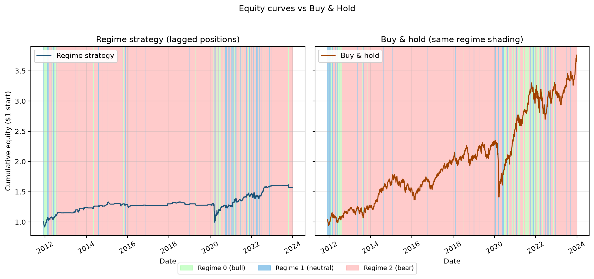
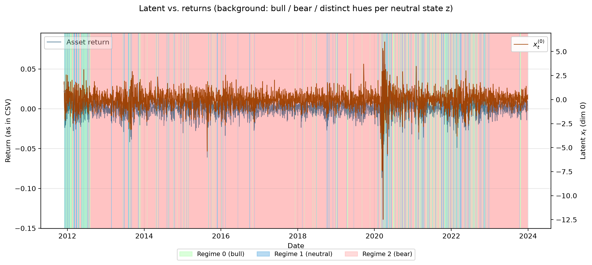
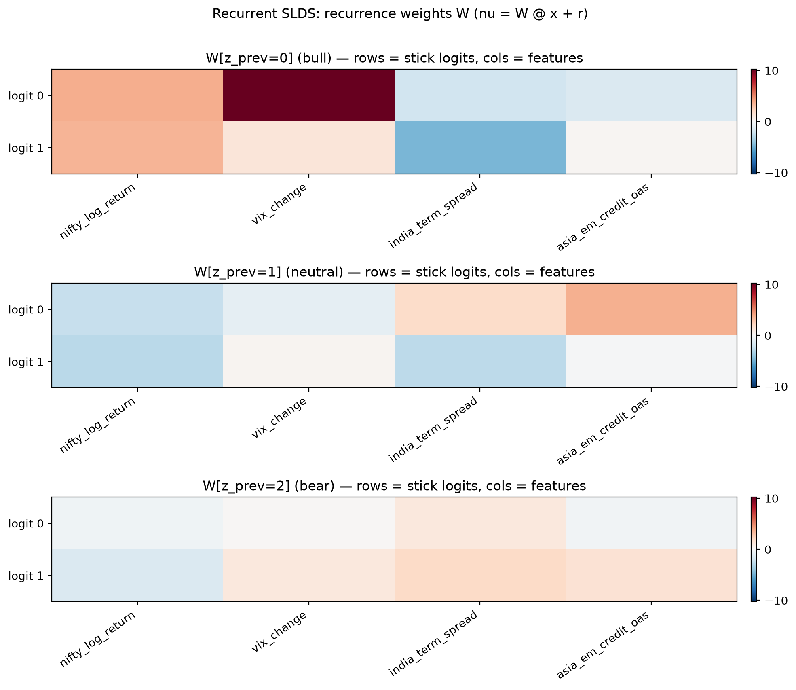

# Bayesian Switching Dynamical Systems for Market Regimes

A production-ready, highly modular Python implementation of state-of-the-art Bayesian switching algorithms for unsupervised regime discovery in financial time series. 

This repository implements the mathematical frameworks of Fox et al. (2008) and Linderman et al. (2017), applying them to a 14-year dataset of macro-economic indicators to identify market regimes without any look-ahead bias.

---

## 📖 Table of Contents
1. [Overview](#overview)
2. [Methodology](#methodology)
3. [The Models](#the-models)
4. [Understanding the Results](#understanding-the-results)
5. [Installation & Requirements](#installation--requirements)
6. [Usage](#usage)
7. [Repository Structure](#repository-structure)
8. [References](#references)

---

## 🔍 Overview

Financial markets undergo constant structural shifts (bull markets, bear markets, high-volatility sideways chops). Standard linear models fail to capture these sudden regime changes.

This codebase uses **Markov Chain Monte Carlo (MCMC)** and **Gibbs Sampling** to fit switching dynamical systems. By analyzing multivariate data (e.g., Equity Returns, Volatility, Yield Spreads, and Credit Spreads), the models automatically segment history into discrete, interpretable economic states.

**Key Capabilities:**
* **Multivariate Observations:** Fuses multiple economic streams into a single observation matrix $y_t \in \mathbb{R}^D$.
* **Non-parametric Priors:** Uses Hierarchical Dirichlet Processes (HDP) to automatically determine the optimal number of regimes from the data.
* **Continuous Latent Waves:** Extracts smooth, hidden economic "waves" (latent variables $x_t$) via Forward-Filtering Backward-Sampling (Kalman FFBS).
* **Predictive Regimes:** Uses Polya-Gamma augmentation in the Recurrent SLDS to determine *which* macroeconomic features predict a regime shift.

---

## 🧠 Methodology

### Data Preprocessing
The observation matrix `y` is built from multiple features, which are normalized using column-wise z-scoring. We ensure strict temporal alignment, forward-filling monthly macro data to daily equity dates.

### Regime Labeling (Economic Interpretation)
The models discover abstract numerical states (e.g., State 0, State 1, State 2). 
To make this actionable, our `backtest.py` maps these states to economic reality post-hoc:
* **Bear Regime:** The state with the lowest mean return during the training window.
* **Bull Regime:** The state with the highest mean return.
* **Neutral Regime:** All intermediate states.

### Trading Strategy & Lagged Positioning
To prevent look-ahead bias, the backtest rule is strictly lagged. The position on day $t$ is decided entirely by the inferred regime from day $t-1$.
* If $z_{t-1}$ is Bull → Hold Asset (100% exposure)
* If $z_{t-1}$ is Bear or Neutral → Hold Cash (0% exposure)

---

## 📐 The Models

1. **Sticky HDP-AR-HMM (`hdp_arhmm.py`)**
   * Uses a weak-limit Hierarchical Dirichlet Process (truncation $L$).
   * Observations follow a Vector Autoregression (VAR) specific to the current regime.
   * Includes a "sticky" parameter ($\kappa$) to prevent the model from rapidly flickering between states.

2. **Sticky HDP-SLDS (`hdp_slds.py`)**
   * Adds a continuous hidden layer $x_t$ beneath the discrete states.
   * Linear-Gaussian emissions: $y_t = C x_t + \eta_t$.
   * Mode-specific dynamics: $x_t = A_{z_t} x_{t-1} + \epsilon_t$.
   * Uses Kalman FFBS to sample the continuous latent state.

3. **Recurrent SLDS (`recurrent_slds.py`)**
   * The most advanced model in the suite (Linderman et al. 2017).
   * Transitions between regimes are driven by the continuous latent state via stick-breaking logits: $\nu = W x_t + r$.
   * Uses **Polya-Gamma augmentation** to allow exact, conjugate Gibbs sampling of the logistic regression weights $W$ and $r$.

---

## 📈 Understanding the Results

When you run the master backtest, the CLI generates several publication-ready charts in the `results/` folder:

### 1. Strategy Backtest (`{model}_strategy_backtest.png`)
Plots the cumulative equity curve of the regime-switching strategy versus a standard Buy & Hold approach. 
* Background shading explicitly colors the historical regimes (Green = Bull, Red = Bear, Gray = Neutral).
* Because this is a raw, un-optimized implementation acting on a minimal feature set, expect standard strategy returns to trail a 14-year mega-bull market. The power here lies in the mathematically pure regime separation.



### 2. Latent State Extraction (`{model}_latent_vs_returns.png`)
* This dual-axis chart plots the raw asset returns alongside the primary extracted continuous latent dimension ($x_t^{(0)}$).
* You can visually see how the Kalman filter smooths noisy market data into a highly readable, continuous "economic wave" that tracks underlying market health.



### 3. Recurrence Weights (`rslds_recurrence_weights.png`)
* **Exclusive to the Recurrent SLDS.**
* Displays a heatmap of the logistic regression weights ($W$).
* This explicitly tells you *which* macro features the model believes are responsible for driving the market from one regime into another (e.g., showing that a spike in Yield Spread strongly triggers a transition into a Bear state).



---

## ⚙️ Installation & Requirements

* **Python 3.10+** (Tested on 3.12 / 3.14)
* **Dependencies:** `numpy`, `scipy`, `matplotlib`, `pandas`, `scikit-learn`, `yfinance`

It is highly recommended to use a virtual environment:
```bash
python3 -m venv .venv
source .venv/bin/activate
pip install -r requirements.txt
```

---

## 🚀 Usage

### 1. Fetching Data
Download and build the `data/market_features.csv` dataset:
```bash
# Downloads NIFTY, India VIX, India Term Spread, and Asia EM Credit OAS
python get_data.py --macro india
```

### 2. Running Backtests
Use the master CLI to train a model and generate results.

**Run the Recurrent SLDS on the full 14-year dataset:**
```bash
python run_master_backtest.py --model rslds --full
```

**Run the Sticky HDP-SLDS with custom Gibbs iterations:**
```bash
python run_master_backtest.py --model hdp_slds --full --n-iter 200 --burn-in 100
```

**Run the HDP-AR-HMM with a specific truncation limit ($L$):**
```bash
python run_master_backtest.py --model hdp_arhmm --full --L 8
```

---

## 📂 Repository Structure

| File | Description |
|------|-------------|
| `get_data.py` | Data downloading pipeline (FRED and Yahoo Finance). |
| `run_master_backtest.py` | Master CLI to scale data, train models, and plot results. |
| `src/hdp_arhmm.py` | Sticky HDP-AR-HMM Gibbs sampler. |
| `src/hdp_slds.py` | Sticky HDP-SLDS Gibbs sampler with Kalman FFBS. |
| `src/recurrent_slds.py` | Recurrent SLDS with Polya-Gamma augmentation. |
| `src/initialization.py` | PCA/AR-HMM initialization pipeline for the rSLDS. |
| `src/backtest.py` | Logic for regime mapping, position sizing, and Matplotlib visualizations. |
| `experiments/` | Scripts for training all cores simultaneously and exporting traces. |

---

## 📚 References
1. **Fox, E. B., Sudderth, E. B., Jordan, M. I., & Willsky, A. S. (2008).** *Nonparametric Bayesian Learning of Switching Linear Dynamical Systems.* NeurIPS.
2. **Linderman, S. W., Johnson, M. J., Miller, A. C., Adams, R. P., Blei, D. M., & Paninski, L. (2017).** *Bayesian Learning and Inference in Recurrent Switching Linear Dynamical Systems.* AISTATS.
3. **Teh, Y. W., et al. (2006).** *Hierarchical Dirichlet Processes.* JASA.
4. **Polson, N. G., Scott, J. G., & Windle, J. (2013).** *Bayesian Inference for Logistic Models Using Polya-Gamma Latent Variables.* JASA.
